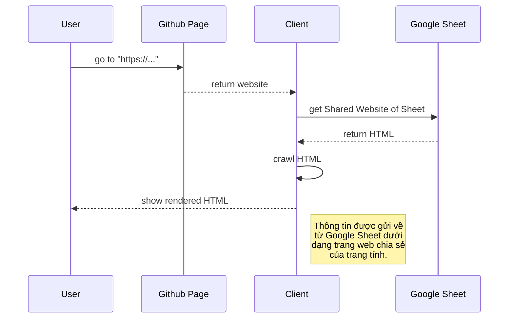
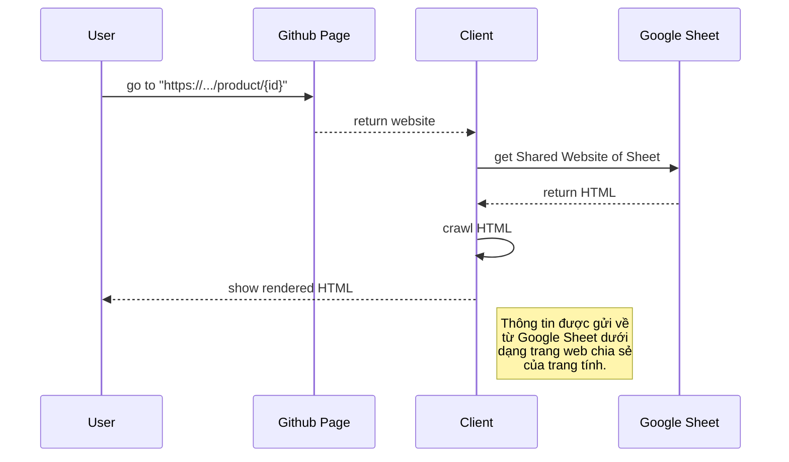
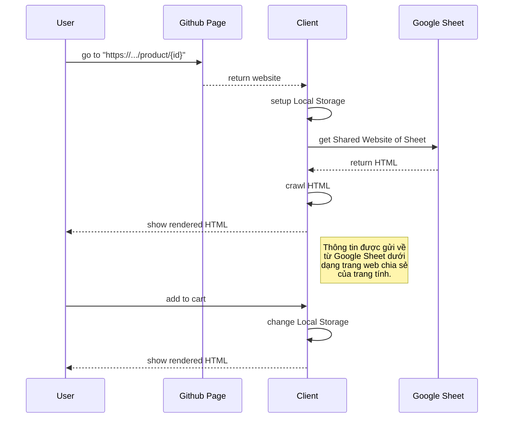
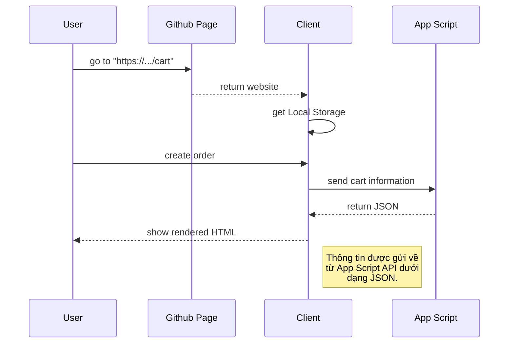
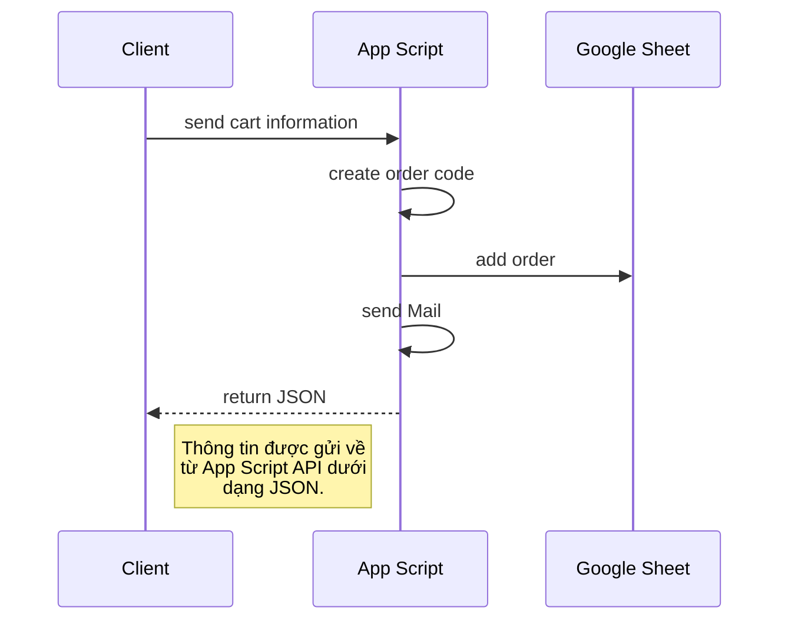
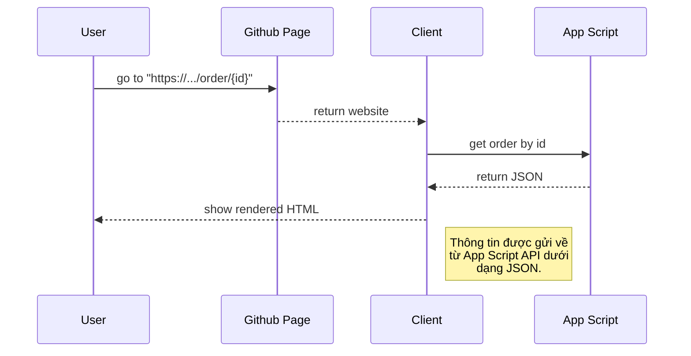
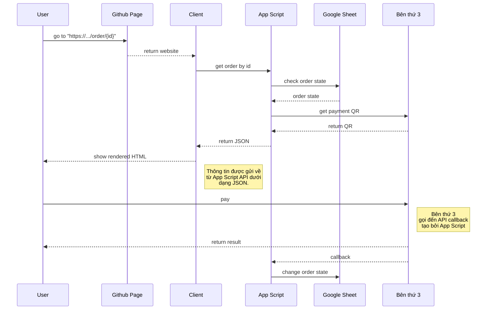

# Welcome to Shopsmon!

Trang web Shopsmon là một trang web thương mại điện tử đơn giản được xây dựng trên hệ thống Google Sheet, Github và Cloudflare. Trong đó, hệ thống Google Sheet thực hiện các phần xử lý và lưu trữ dữ liệu, Github thực hiện việc host giao diện tương tác với người dùng thông qua Github Page, Cloudflare là nhà cung cấp dịch vụ domain và các dịch vụ bảo vệ trang web. Shopsmon chỉ là hệ thống thương mại đơn giản chưa mang tính tối ưu cũng như đảm bảo một số tính chất của một hệ thống TMĐT hoàn thiện. Tài liệu này mang tính tham khảo và nghiên cứu phát triển.

# Hệ thống thương mại điện tử

Phần này cung cấp một số thông tin về hệ thống thương mại điện tử

## Định nghĩa

* Tiến hành hoạt động kinh doanh (ví dụ, phân phối, mua, bán, tiếp thị và phục vụ sản phẩm/dịch vụ) bằng điện tử trên mạng máy tính như Internet, Extranet, và mạng doanh nghiệp.
* Nội dung đa dạng, phụ thuộc vào từng quốc gia.
* Nghị định 52/2013/NĐ-CP ngày 16/5/2013 của Chính phủ: Hoạt động thương mại điện tử là việc tiến hành một phần hoặc toàn bộ quy trình của hoạt động thương mại bằng phương tiện điện tử có kết nối với mạng Internet, mạng viễn thông di động hoặc các mạng mở khác.

## Một số hình thức và tính chất của hệ thống thương mại điện tử

Các hệ thống thương mại điện tử có thể chia thành các hình thức: C2B, B2C, B2B, C2C, B2E, B2G, G2B, G2G, G2C. Trong đó, hình thức B2C, TMĐT doanh nghiệp bán trực tiếp hàng hóa tới người tiêu dùng, là hình thức dễ nhận thấy và phổ biến trong các lĩnh vực bán lẻ như Amazone, Shopee, Alibaba. Hình thức C2C, người  tiêu  dùng  bán  trực  tiếp HH/DV tới  người  tiêu  dùng, đang là hình thức mới nổi như Ebay, các chợ bán đồ cũ. Ngoài ra còn có một số hình thức khác như Dropshipping, Print on demand. Một trong những tính chất quan trọng của hệ thống TMĐT là tính riêng tư (Privacy).

# Các thành phần của Shopsmon

Phần này cung cấp thông tin chi tiết về các thành phần của Shopsmon. Lưu ý: trang web Shopsmon chưa có tính năng phân quyền người dùng và một số tính năng chưa tối ưu. Tài liệu mang tính tham khảo :)))))

## Hiển thị thông tin sản phẩm từ Google Sheet

Phía client sẽ lấy dữ liệu từ web công khai của trang tính được chọn dưới dạng HTML sau đó sử dụng kỹ thuật crawl bằng Javascript, Ví dụ: Regex, Vanilla JS Scraper, Puppeteer, để chuyển dữ liệu sang dạng JSON và render ra HTML. Đối với dữ liệu dạng ảnh, dữ liệu trả về là một url có dạng "https://...." trong đó "" là kích thước ảnh trả về, ta có thể dựa vào thông số đó để hiển thị trên website tối ưu hơn (kích thước nhỏ cho các hình preview, kích thước gốc khi bấm phóng to). Dưới đây là quy trình tạo một website của trang tính:
* Vào mục **Tệp** &rarr; **Chia sẻ** &rarr; **Công bố lên web**
* Chọn mục **Đường liên kết**. Trong đó chọn trang tính cần công bố, loại hình công bố (**Trang web**) và bấm vào **Xuất bản**
* Lưu lại đường dẫn đến trang web.  

## Hiển thị thông tin chi tiết sản phẩm theo đường dẫn

Github Page nhận id thông qua path parameter của đường dẫn thông qua cơ chế redirect để trả về file html, js, css tương ứng. Thông thường, ta sẽ cho mọi path đều redirect về index.html, và script trong index.html sẽ làm nhiệm vụ đọc và phân tích đường dẫn để render cho phù hợp.
> **Note:** Xem thêm về path routing của Reactjs và Vuejs.
> **Note:** Một trick khác là modify lại file 404.html. Mọi path mà không tìm thấy thì Github Page sẽ mặc định trả về file 404.html

## Thêm sản phẩm vào giỏ hàng (add to cart)

## Tạo đơn hàng

## Tạo mã cho đơn hàng và gửi Mail

> **Note:** Xem file "https://gist.github.com/daovietanh190499/e9d722071846e15afb66054246b0cfb4".

## Hiển thị đơn hàng theo mã đơn hàng

> **Note:** Xem file "https://gist.github.com/daovietanh190499/b77adaa3b643758afd24c4a90e1ba0bc".

## Cấu trúc phiếu giao hàng

* Logo trang web: có thể đặt cố định
* Barcode mã đơn hàng công thức : ="*"&B3&"*" Trong đó **B3** là ô chứa mã đơn hàng do nhân viên nhập
* Tên mã đơn hàng công thức: =" Mã đơn hàng: "&B3
* Thông tin người gửi: có thể đặt cố định
* Thông tin người nhận công thức: ="Đến: "&INDEX(orders!B2:B996;  MATCH(B3;  orders!G2:G996;  0))&" "&INDEX(orders!E2:E996;  MATCH(B3;  orders!G2:G996;  0))&" SĐT: "&INDEX(orders!C2:C996;  MATCH(B3;  orders!G2:G996;  0))  Trong đó các cột B, C, E, G được lấy từ bảng **orders** là các thông tin tương ứng của người nhận được match với mã đơn tại ô **B3**
* Mã QR URL đơn hàng công thức: =image("https://chart.googleapis.com/chart?cht=qr&chs=200x200&chl="&encodeurl("https://shopsmon.com/cart/"&B3&""))
* Mục nội dung đơn hàng công thức này chứa thuật toán để chuyển đổi thông tin dạng JSON string (do thông tin giỏ hàng được lưu dạng JSON) sang chuỗi mong muốn: =ARRAY_CONSTRAIN(ARRAYFORMULA(SUBSTITUTE(SUBSTITUTE(SUBSTITUTE(SUBSTITUTE(SUBSTITUTE(INDEX(orders!F2:F996;  MATCH(B3;  orders!G2:G996;  0));  J18;  "- ");  J19;  ", Số lượng: ");  J20;  " x ");  J21;  " - ");  J22;  ""));  1;  1) trong đó **J18** là {"list":[{"id":" **J19** là ","counter": **J20** là ,"name":" **J21** là "},{"id":" **J22** là "}]}      Ý tưởng của  thuật toán này là thay thế các pattern từ **J18** đến **J22** bởi các chuỗi khác có ý nghĩa.
* Tiền thu người nhận: mục này có thể giữ cố định
> **Note**: Nguyên nhân sử dụng fomular thay vì các hàm của app script là do tốc độ thực thi của fomular nhanh hơn hàm của app script rất nhiều. Do đó hạn chế tối đa việc viết fomular sử dụng hàm của app script.

## Thay đổi trạng thái đơn hàng

Cột trạng thái đơn hàng **order_status** của trang tính **orders** có dạng lựa chọn. bảng **orders** được phân quyền để cho phép các tài khoản nhân viên có thể thay đổi duy nhất cột trạng thái đơn hàng. Các bước thực hiện:
* Chọn tất cả cột trạng thái đơn hàng
* Bấm nút phải chuột và chọn **Trình đơn thả xuống**
* Thêm các trạng thái cho đơn hàng, cụ thể trong trường hợp của Shopsmon là các trạng thái "**created**" thể hiện việc đơn hàng vừa được tạo, "**validated**" đơn hàng đã được kiểm chứng và thanh toán, "**delivering**" đơn hàng trong trạng thái được vận chuyển, "**received**" đơn hàng đã được nhận bởi người dùng, "**cancelled**" đơn hàng đã bị hủy, "**return**" đơn hàng bị trả lại hoặc bị lỗi. 
* Để phân quyền sử dụng dải ô, vào **Dữ liệu** &rarr; **Bảo vệ Trang tính và Dải ô** &rarr; chọn dải ô cần bảo vệ ngoại trừ dải ô trạng thái.

## Tính năng Chat với shop thông qua Facebook

Chức năng Chat với shop thông qua Facebook cho phép khách hàng trao đổi với nhân viên các vấn đề về đơn và giao dịch và một số thông tin khác. Hiện nay, Facebook hỗ trợ nhúng các bong bóng chat dành cho Facebook Page vào trang web thông qua một đoạn script. Người sử dụng cần cấu hình domain và một số thông tin về trả lời tự động cũng như build Page để tính năng hoạt động tốt. Để tìm hiểu thêm truy cập "https://developers.facebook.com/"

## Thanh toán (chưa được implement thực tế)

## Các tính năng khác

Ngoài các tính năng trên, Shopsmon còn có các tính năng xem các đơn hàng gần đây nhất, lọc các đơn hàng ảo theo xác xuất, thống kê các đơn hàng, một số tính năng sử dụng với ChatGPT, Phân quyền người dùng, ... Để biết thêm chi tiết vui lòng liên hệ. 
